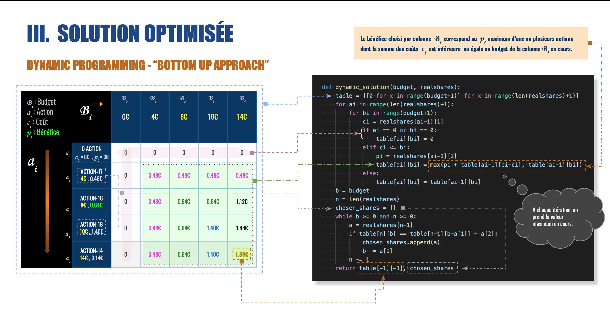

# Algo Invest & Trade

## Installation & Utilisation
### Fichiers & Dossiers
#### Dossiers
* Data: toutes les données requises dans ce projet
* img: image d'introduction de la présentation du projet
#### Fichiers
* **bruteforce.py**: à utiliser pour les 20 premières actions
* **optimised.py**: à utiliser pour les 20 premières actions
* **optimised2.py**: légèrement modifié pour utiliser avec les 2 lots d'actions de Sienna
* graphs.py: à utiliser pour visualiser les données du dossier Data
* requirements: modules/packages du projet
## Auteur
* **Didier K Nzimbi** _alias_ [dbahsa](https://github.com/dbahsa)

